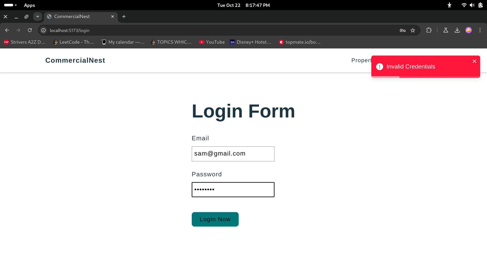

Login Page :

The sign-in form contains fields for the user's email and password. When users input their login details and press the submit button, it initiates the process for checking the validity of the information and verifying their account credentials.

Registration :

The signup page enables new users to set up an account by filling in fields such as username, email, phone number, and password. The user interface is built using React, while form validation is managed with the Zod library. After successful submission and validation, users are taken to the login page.

Home Page :

JWT Authentication:

After a user logs in, a JSON Web Token (JWT) is created to confirm their identity. This token, which includes encoded information like the user's ID, is sent to the client. The JWT is then used for authentication in future requests, ensuring the user's identity is verified.

Properties List :

How They Work Together :

1. Node.js and Express.js: Handle server-side logic, routing, and API creation.

2. JWT: Integrated with Express middleware to manage authentication securely.

3. MongoDB: Stores user data, ensuring fast, flexible, and scalable data access.
